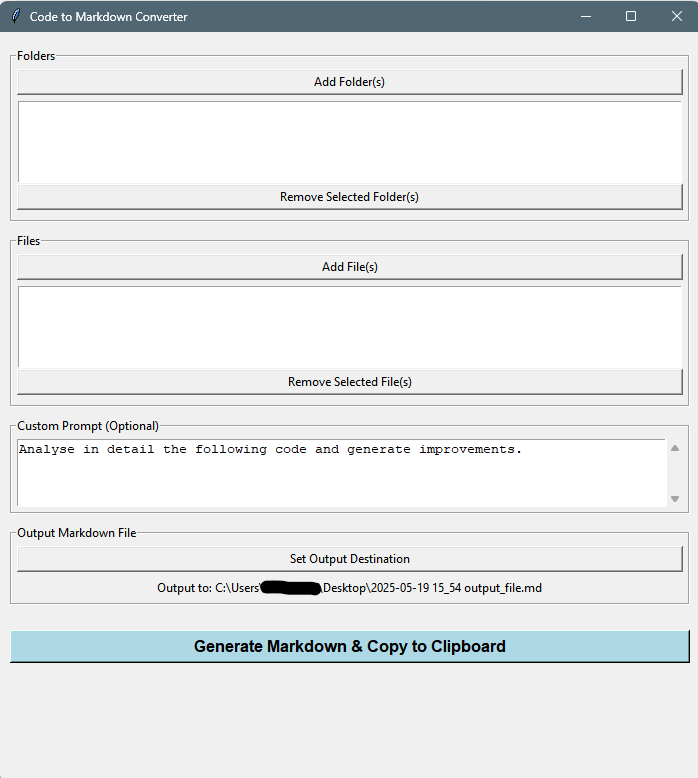

# Code to Markdown Converter

A simple GUI tool to collect code files (from selected files and/or folders), merge them into a clean Markdown document (with syntax highlighting), and copy the result to the clipboard for quick prompt engineering, documentation, or code review purposes.

 <!-- Add a screenshot image named screenshot.png for a better README -->

## Features

- Select multiple folders and files; scans folders recursively
- Supports many code/text formats (`.py`, `.js`, `.java`, `.md`, `.txt`, etc.)
- Outputs a well-formatted Markdown file with syntax-highlighted code blocks and relative file paths
- Optional **custom prompt/instruction** to preface the code in the document
- Outputs to your Desktop by default (configurable)
- Copies the resulting Markdown directly to your clipboard (requires [pyperclip](https://pypi.org/project/pyperclip/))
- Works on Windows, macOS, and Linux

## Installation

1. **Clone or Download:**
    ```bash
    git clone https://github.com/yourusername/your-repo-name.git
    cd your-repo-name
    ```

2. **Install Dependencies:**
    ```bash
    pip install pyperclip
    ```

    > `pyperclip` is optional but highly recommended for clipboard copying to work.

3. **(Optional, Linux only)**  
   For clipboard copy on Linux, you may need `xclip` or `xsel`:
    ```bash
    sudo apt-get install xclip
    # or
    sudo apt-get install xsel
    ```

## Usage

1. Run the program:
    ```bash
    python CodePromptGenerator.py
    ```
2. Use the graphical interface:
   - **Add Files/Folders:** Select your source code (folders can be recursive).
   - **Enter Custom Prompt:** Optionally, enter a custom instruction to add atop the Markdown file.
   - **Set Output Destination:** Choose where to save the Markdown file (optional; defaults to Desktop).
   - **Generate:** Click **Generate Markdown & Copy to Clipboard**.

3. After generating:
   - The Markdown is saved to your chosen location.
   - The content is copied to your clipboard (if supported).
   - You get a summary box confirming success.

## Supported File Types

- Python, JavaScript, Java, TypeScript, HTML, CSS, XML, Bash, Ruby, Go, C/C++, C#, Swift, PHP, Markdown, Text, JSON, YAML, SQL, R, Perl, and more.

## Requirements

- Python 3.7+
- Tkinter (usually included with Python)
- [pyperclip](https://pypi.org/project/pyperclip/) (`pip install pyperclip`)

## Notes

- The app only processes files with recognized code or text extensions.
- File and folder selections are de-duplicated.
- On first launch, output defaults to your Desktop. You can change the path.
- For large projects, output can be hundreds of code blocks if many files are chosen.

## License

GNU License. See [LICENSE](LICENSE) for details.

---

*Made with ❤️ for faster code documentation and prompt engineering.*
